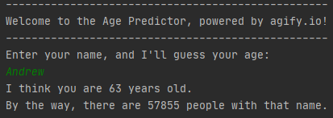

# Overview
Simply enter your name, and the program will guess your age, as well as tell you
how many people in the world have that name.
The program uses built-in Java methods to send an HTTP request that retrieves a string in JSON format.
It then needs to be parsed, which is accomplished in just a few lines of code
by using a third-party library.

# Environment
* IntelliJ IDEA or any other IDE with Java integrated
* **Most importantly**, you will need [this](https://github.com/stleary/JSON-java) JSON parser external library.

# Execution

* Make sure you aren't missing any libraries, and hit Run. It should look like this:

# Useful Websites
* [Sample API for testing](https://jsonplaceholder.typicode.com/users)
* [Java HttpClient documentation](https://docs.oracle.com/en/java/javase/11/docs/api/java.net.http/java/net/http/HttpClient.html)